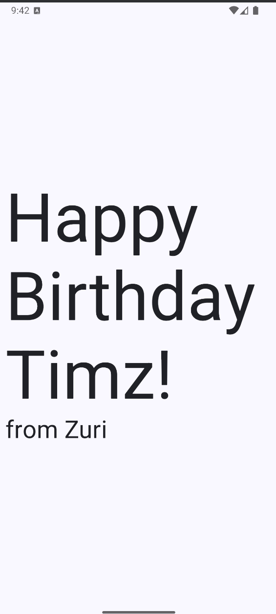
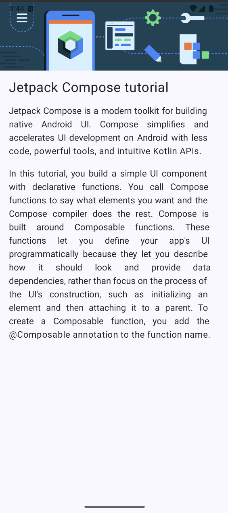
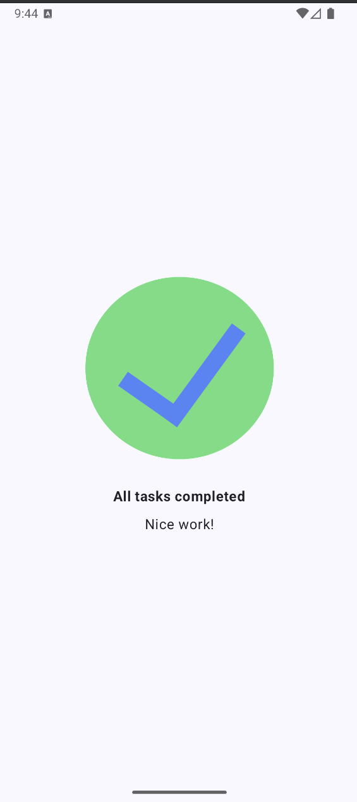
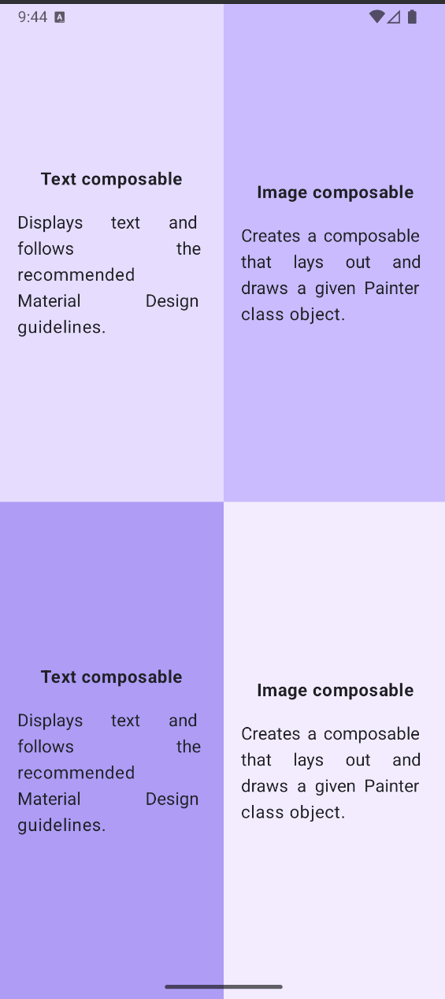
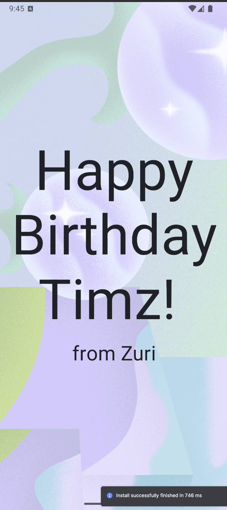
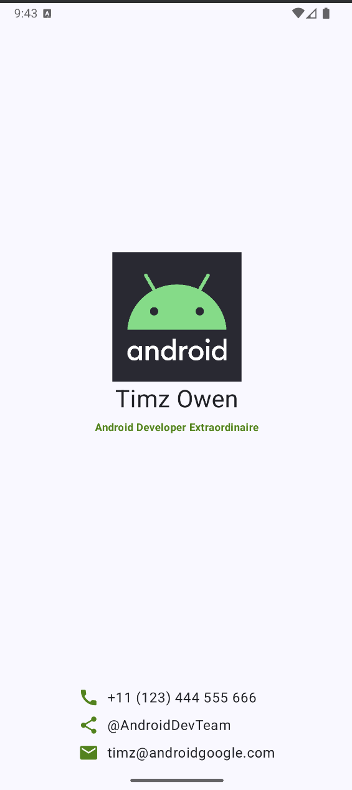

# Jetpack Compose Learning Series

A quick series of small Jetpack Compose apps to practice core layout and UI patterns.

## Apps included
- Happy Birthday app
- Compose Article app
- Task app (Task Done)
- Compose Quadrant app
- Adding Images demo
- Business Card app

## Screenshots

<table>
  <tr>
    <td style="text-align:center;">
      
      <div>Happy Birthday app</div>
    </td>
    <td style="text-align:center;">
      
      <div>Compose Article app</div>
    </td>
  </tr>
  <tr>
    <td style="text-align:center;">
      
      <div>Task app (Task Done)</div>
    </td>
    <td style="text-align:center;">
      
      <div>Compose Quadrant app</div>
    </td>
  </tr>
  <tr>
    <td style="text-align:center;">
      
      <div>Adding Images demo</div>
    </td>
    <td style="text-align:center;">
      
      <div>Business Card app</div>
    </td>
  </tr>
</table>

## Getting started
- Open the project in Android Studio (Giraffe+ recommended).
- Make sure you have an Android Emulator or device connected.
- Select the desired app branch from the branch selector (e.g. `happy-birthday`,
- Choose a sample branch and checkout then run, or build the Debug APK via Gradle.


Quick build from terminal (macOS/zsh):

```sh
./gradlew assembleDebug
```
